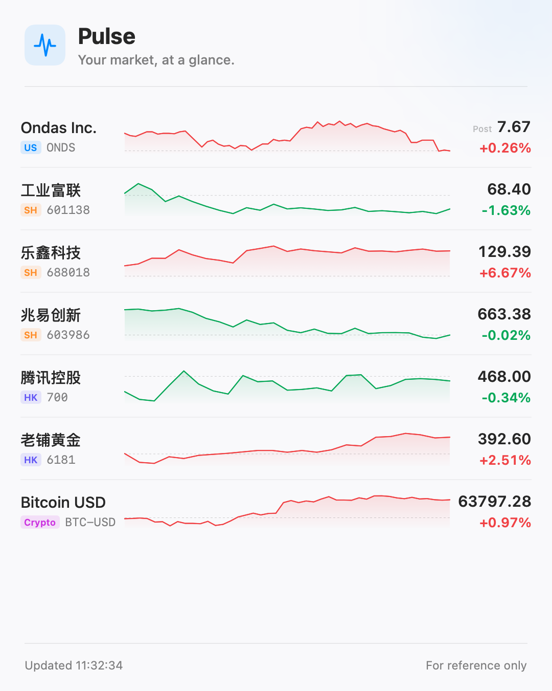

# Pulse

**Glanceable market data for the macOS menu bar.**

**Website:** [www.pulseticker.app](https://www.pulseticker.app/)

Pulse is a lightweight market-watching app, not a trading terminal. It solves exactly one problem: seeing how the symbols you care about are doing — and whether your positions are up or down — in the shortest possible time, without leaving what you're working on.



## Features

- **Menu bar ticker**: icon-only by default (discreet); optionally show quotes as a pinned single symbol (`NVDA 188.3 +2.1%`) or a carousel rotating through your watchlist
- **Watchlist** supporting US stocks, Hong Kong stocks, China A-shares, cryptocurrencies, indices, and ETFs — add by ticker, name, or pinyin search
- **Position tracking**: quantity, cost basis, market value, daily P&L, and total P&L
- **Quote detail view**: price, change, OHLC, volume, amplitude, realtime / delayed status, quote source, and market-specific timestamp in a dense menu-bar layout
- **Charts**: intraday lines and daily / weekly / monthly candlesticks with OHLC and volume, sourced from the best available provider per market
- **Share images**: copy a branded, mobile-friendly watchlist image that follows the current metric selection and adapts to list length
- **Multi-provider data layer**: providers are routed per market, cached to reduce duplicate requests, and fail over automatically when one is rate-limited or down
- **Real-time crypto via Binance**: cryptocurrency search, quotes, and charts use Binance Spot public market-data endpoints, with a locally cached 24-hour symbol catalog and 1-second WebSocket ticker updates while the popover is open; Pulse stores crypto as a structured base/quote pair and displays it as `BTC/USDT`
- **Real-time via Longbridge**: optionally connect your own [Longbridge](https://open.longbridge.com) account (browser authorization or API keys) to upgrade HK / US / A-share quotes to official real-time data, streamed live over a push connection — including the US overnight session
- **Session-aware, per-source refresh**: each provider polls at its own configurable cadence, and only while its markets are open — saving power and avoiding rate limits; push-capable sources stream instead of polling
- **Language control**: follows the system language when possible, with manual switching between English and Simplified Chinese

## Installation

Download the latest `Pulse-*.dmg` from [GitHub Releases](https://github.com/fatwang2/Pulse/releases), open it, and drag `Pulse.app` to Applications before launching. The `Pulse-*.zip` asset is used by Sparkle for automatic updates.

## Privacy & Analytics

Pulse uses [TelemetryDeck](https://telemetrydeck.com) to understand basic product usage. Anonymous
analytics are enabled by default and can be disabled at any time in **Settings → General → Share
Anonymous Usage Data**. Once disabled, Pulse stops queuing new analytics events.

Pulse currently sends only these product-interaction events:

- `Pulse.app.launched`
- `Pulse.popover.opened`
- `Pulse.settings.opened`
- `Pulse.refresh.manualRequested`
- `Pulse.settings.analyticsEnabled` — sent only when analytics are turned back on

TelemetryDeck's Swift SDK automatically adds basic technical context such as the Pulse version and
build, macOS version, device model and architecture, language, locale, region, time zone, display
properties, and whether the build is a debug or App Store build. On macOS, the SDK also generates a
random pseudonymous device identifier and a session identifier. Pulse does not provide TelemetryDeck
with a name, email address, account identifier, or other custom user identifier.

Pulse never adds watched symbols, watchlists, positions, quantities, cost bases, search text,
market-data responses, Longbridge credentials, or other user-provided content to analytics events.
TelemetryDeck's bundled privacy manifest declares product-interaction data and a device identifier
for analytics; the data is not linked to the user's identity and is not used for tracking. Pulse has
no advertising or cross-app tracking. The complete event boundary is intentionally kept in
[`PulseTelemetry.swift`](PulseMac/Sources/PulseTelemetry.swift) so the implementation can be audited.

## Building

Requires **Xcode 26+** and [XcodeGen](https://github.com/yonaskolb/XcodeGen). `Pulse.xcodeproj` is generated from `project.yml` and is not checked in.

```bash
# Generate the Xcode project and build
xcodegen generate
xcodebuild -project Pulse.xcodeproj -scheme PulseMac -configuration Debug build

# Or build, launch, and verify the menu-bar process
./scripts/dev-mac.sh --verify
```

The development script uses the first valid Apple Development identity in the builder's
local Keychain so macOS recognizes repeated Debug builds as the same app. If no development
certificate is available, it falls back to ad-hoc signing. Development certificates and
private keys never enter the repository; every contributor signs with their own local identity,
and release signing and notarization remain a separate workflow.

For local telemetry testing, supply the TelemetryDeck app identifier as a build setting. An empty
or missing value disables analytics for that build:

```bash
TELEMETRYDECK_APP_ID="your-app-id" ./scripts/dev-mac.sh --telemetry
```

The app identifier is embedded in configured builds and is not a secret or an API credential.

Tests live in the `PulseCore` package:

```bash
# Unit tests (includes Binance/Tencent/Yahoo parsing via recorded fixtures)
cd Packages/PulseCore && swift test

# Unit tests plus provider contracts against the live endpoints
PULSE_LIVE_TESTS=1 swift test
```

## Releasing

The release pipeline lives in `scripts/release-mac.sh`. It archives, signs,
notarizes, packages, and uploads Pulse together with its Sparkle appcast.
Version-specific GitHub Release copy lives in `.github/release-notes/<version>.md`.
Both are tracked so a release can be reproduced from the repository.

## Architecture

- **`Packages/PulseCore`** — pure Swift, no UI: models, data providers, trading calendars, persistence, and the refresh scheduler. Shared across Mac / iOS / widget targets.
- **`Packages/PulseUI`** — shared SwiftUI components: candlestick chart, intraday chart, sparkline, gain/loss colors.
- **`PulseMac`** — the macOS menu bar app (`MenuBarExtra`, `LSUIElement=true`).

All market data flows through the `QuoteProvider` protocol abstraction. A `CompositeProvider` routes requests per market and candle period, caches recent responses, breaks the circuit on unhealthy providers, and composes data from multiple sources (e.g. realtime crypto from Binance, realtime A-share quotes and intraday lines from Tencent, broad securities coverage from Yahoo, and real-time securities streaming from a connected Longbridge account). Crypto identity is stored provider-independently as separate base and quote assets; Binance renders `BTCUSDT` on the wire while Pulse displays `BTC/USDT`. Binance is the sole source for cryptocurrency search, quotes, and candles: Pulse never silently substitutes Yahoo's different `BTC-USD` instrument for `BTC/USDT`. Binance's current Spot symbol directory is cached on disk for 24 hours, refreshed in the background when stale, and searched locally with USDT pairs ranked first. Binance and Longbridge can stream different markets concurrently. The Longbridge integration speaks the OpenAPI binary WebSocket protocol directly — no SDK dependency — and stores credentials only in the local Keychain.

Quotes carry their active source and source-specific delay metadata through the app. The watchlist footer shows the live feed status, while each symbol detail view shows that symbol's realtime / delayed status, active source, and market timestamp with the relevant time basis.

## Data Sources & Disclaimer

Out of the box, Pulse uses Binance's public Spot market-data API for cryptocurrency prices plus **free, unofficial** quote endpoints from Yahoo Finance and Tencent for broader coverage. No Binance account or API key is required. These public feeds have no SLA and may be rate-limited, unavailable in some regions, or change over time. Optionally, you can connect your own **Longbridge OpenAPI** account for official real-time securities quotes delivered by push; quote entitlements follow your account, and credentials never leave the local Keychain. Quote delay varies by provider and market; each source's per-market freshness is spelled out on its detail page. All data is for reference only and is **not investment advice**.

## License

[MIT](LICENSE)
