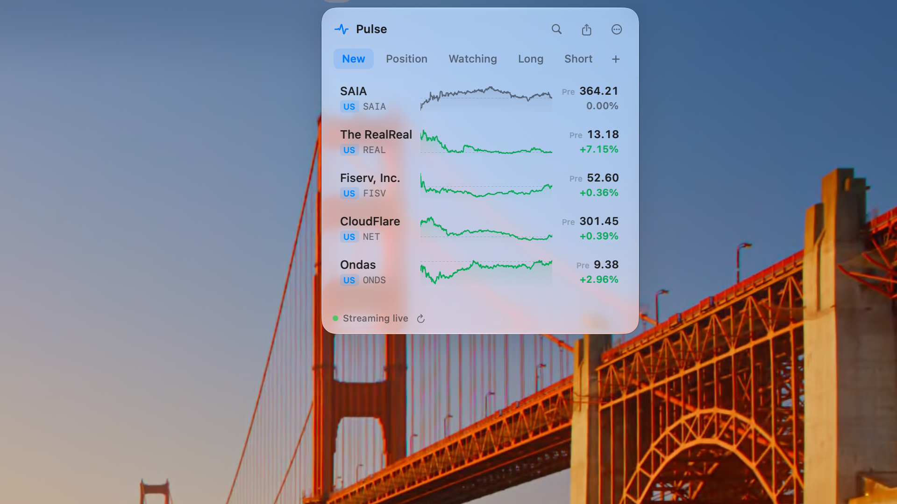
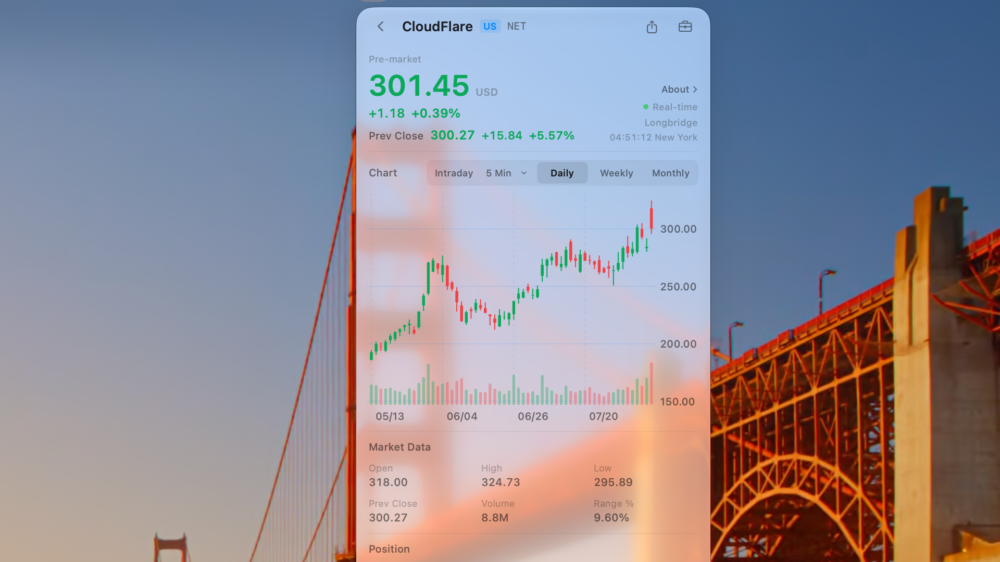
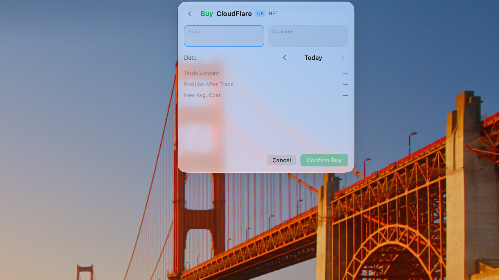

# Pulse

**Glanceable market data for the macOS menu bar.**

**Website:** [www.pulseticker.app](https://www.pulseticker.app/)

Pulse is a lightweight market-watching app, not a trading terminal. It solves exactly one problem: seeing how the symbols you care about are doing — and whether your positions are up or down — in the shortest possible time, without leaving what you're working on.

| Watchlist | Quote Detail | Record Trade |
|:---:|:---:|:---:|
|  |  |  |

## Features

- **Menu bar ticker**: icon-only by default (discreet); optionally show quotes as a pinned single symbol (`NVDA 188.3 +2.1%`) or a carousel rotating through your watchlist
- **Watchlists** supporting US stocks, Hong Kong stocks, China A-shares, Japanese and Korean stocks, cryptocurrencies, precious metals, indices, and ETFs — organize symbols into named lists, pin favorites per list, and reorder them with native drag and drop
- **Position tracking**: quantity, cost basis, market value, daily P&L, and total P&L
- **Quote detail view**: price, change, OHLC, volume, amplitude, realtime / delayed status, quote source, and market-specific timestamp in a dense menu-bar layout
- **Charts**: intraday lines and daily / weekly / monthly candlesticks with OHLC and volume, sourced from the best available provider per market
- **Sharing**: copy a branded, mobile-friendly image, or export an English structured market snapshot with source, timestamp, session, and chart data for analysis in an LLM
- **MCP for agents**: opt-in local [Model Context Protocol](https://modelcontextprotocol.io) server (Streamable HTTP on loopback) so Claude, ChatGPT, and any MCP-compatible client can read and edit watchlists, positions, and trades while Pulse is running — Settings → Agents → MCP
- **Multi-provider data layer**: providers are routed per market, cached to reduce duplicate requests, and fail over automatically when one is rate-limited or down
- **Real-time crypto via Binance**: cryptocurrency search, quotes, and charts use Binance Spot public market-data endpoints, with a locally cached 24-hour symbol catalog and 1-second WebSocket ticker updates while the popover is open; Pulse stores crypto as a structured base/quote pair and displays it as `BTC/USDT`
- **Precious metals**: nine instruments across both sides of the market — London spot gold and silver, the COMEX / NYMEX contracts (gold, silver, platinum, palladium), the Shanghai Gold Exchange's Au99.99 spot contract, and the SHFE gold and silver futures. The Shanghai instruments price in CNY per gram on a Chinese session with its own night leg; the rest quote in USD per ounce. Spot leads everywhere, because that is what "黄金" and "gold" mean to someone asking the price. Quotes come from Tencent's international channel and Sina, history from Yahoo (COMEX), Sina (London spot, SHFE), the exchange's own daily file (Au99.99) and Eastmoney (Au99.99 intraday) — Yahoo has never carried a working spot symbol and covers no Chinese exchange. Pulse owns the metal catalog, so "黄金" offers all three golds, while "现货黄金" / "黄金期货" / "沪金" name one each; searching "gold", "XAU", "GC" or "贵金属" works too, even though no provider's search index covers the channel
- **Real-time via Longbridge**: optionally connect your own [Longbridge](https://open.longbridge.com) account (browser authorization or API keys) to upgrade HK / US / A-share quotes to official real-time data, streamed live over a push connection — including the US overnight session
- **Japan and Korea**: Tokyo (Prime, Standard and Growth) plus both Korea Exchange boards, KOSPI and KOSDAQ, with the Nikkei 225 and the KOSPI Composite alongside them. Tokyo's 11:30–12:30 lunch break folds out of the intraday axis the way Hong Kong's and Shanghai's do; Seoul trades straight through. Korea is real time through Naver, which also answers Korean-language search and is authoritative about which board a code belongs to — that matters, because the board is part of the address and cannot be derived from the code (035720 is KOSPI, not KOSDAQ, and Yahoo's `.KQ` symbol for it prices something else entirely). Japan is delayed about twenty minutes via Yahoo: its exchange licenses even the fifteen-minute feed, so no free real-time source exists. Japanese stocks are found by their four-character exchange code: Yahoo indexes no Japanese names (`任天堂` returns nothing) and an English name competes with every ADR and foreign listing of the same company, so `nintendo` reaches no Tokyo listing at all. Korean stocks are reachable either way — Naver answers `삼성전자`, Yahoo answers `samsung`
- **Session-aware, per-source refresh**: each provider polls at its own configurable cadence, and only while its markets are open — saving power and avoiding rate limits; push-capable sources stream instead of polling
- **Language control**: follows the system language when possible, with manual switching between English, Simplified Chinese, and Japanese

## Agent access (MCP)

Pulse can expose an opt-in **MCP** endpoint on your Mac so Claude, ChatGPT, and any MCP-compatible client can work with the same watchlists and trades you see in the menu bar. Nothing is uploaded: the server binds `127.0.0.1` only, and access requires a Bearer token stored in the Keychain.

1. Open **Settings → Agents → MCP** and enable the server.
2. In your MCP client, add a **Streamable HTTP** server using the endpoint and token shown in Pulse.

Tools cover listing groups and positions, searching symbols, creating/renaming/deleting groups, adding/removing symbols, recording and deleting trades, calibrating positions, and reordering groups or custom symbol order. The token grants the same write surface as those tools — regenerate it anytime from the MCP settings page.

## Installation

Download the latest `Pulse-*.dmg` from [GitHub Releases](https://github.com/fatwang2/Pulse/releases), open it, and drag `Pulse.app` to Applications before launching. The `Pulse-*.zip` asset is used by Sparkle for automatic updates.

## Support & Feedback

- **Bug reports and feature requests**: [GitHub Issues](https://github.com/fatwang2/Pulse/issues/new/choose). The templates ask for the details we need to reproduce a problem.
- **Email**: [hello@pulseticker.app](mailto:hello@pulseticker.app) for questions or anything you would rather keep private. Security reports go to [sys@pulseticker.app](mailto:sys@pulseticker.app), not a public issue.
- **From the app**: **More (…) → Feedback** drafts an email with your Pulse and macOS versions filled in, and **Copy Diagnostics Report** copies the versions, data-source status, and recent log lines from the current session for pasting into the email or an issue. The report never includes your symbols, positions, or credentials. **Settings → Support** shows the address itself, so it can be copied when no mail client is set up.

## Privacy & Analytics

Pulse uses [TelemetryDeck](https://telemetrydeck.com) to understand basic product usage. Anonymous
analytics are enabled by default and can be disabled at any time in **Settings → General → Share
Anonymous Usage Data**. Once disabled, Pulse stops queuing new analytics events.

Pulse currently sends only these product-interaction events:

- `Pulse.app.launched`
- `Pulse.popover.opened`
- `Pulse.settings.opened`
- `Pulse.refresh.manualRequested`
- `Pulse.settings.analyticsEnabled` — sent only when analytics are turned back on

TelemetryDeck's Swift SDK automatically adds basic technical context such as the Pulse version and
build, macOS version, device model and architecture, language, locale, region, time zone, display
properties, and whether the build is a debug or App Store build. On macOS, the SDK also generates a
random pseudonymous device identifier and a session identifier. Pulse does not provide TelemetryDeck
with a name, email address, account identifier, or other custom user identifier.

Pulse never adds watched symbols, watchlists, positions, quantities, cost bases, search text,
market-data responses, Longbridge credentials, MCP tokens, or other user-provided content to analytics events.
TelemetryDeck's bundled privacy manifest declares product-interaction data and a device identifier
for analytics; the data is not linked to the user's identity and is not used for tracking. Pulse has
no advertising or cross-app tracking. The complete event boundary is intentionally kept in
[`PulseTelemetry.swift`](PulseMac/Sources/PulseTelemetry.swift) so the implementation can be audited.

## Building

Requires **Xcode 26+** and [XcodeGen](https://github.com/yonaskolb/XcodeGen). `Pulse.xcodeproj` is generated from `project.yml` and is not checked in.

```bash
# Generate the Xcode project and build
xcodegen generate
xcodebuild -project Pulse.xcodeproj -scheme PulseMac -configuration Debug build

# Or build, launch, and verify the menu-bar process
./scripts/dev-mac.sh --verify
```

The development script uses the first valid Apple Development identity in the builder's
local Keychain so macOS recognizes repeated Debug builds as the same app. If no development
certificate is available, it falls back to ad-hoc signing. Development certificates and
private keys never enter the repository; every contributor signs with their own local identity,
and release signing and notarization remain a separate workflow.

For local telemetry testing, supply the TelemetryDeck app identifier as a build setting. An empty
or missing value disables analytics for that build:

```bash
TELEMETRYDECK_APP_ID="your-app-id" ./scripts/dev-mac.sh --telemetry
```

The app identifier is embedded in configured builds and is not a secret or an API credential.

Tests live in the `PulseCore` package:

```bash
# Unit tests (includes Binance/Tencent/Yahoo parsing via recorded fixtures)
cd Packages/PulseCore && swift test

# Unit tests plus provider contracts against the live endpoints
PULSE_LIVE_TESTS=1 swift test
```

## Releasing

**Releases are built and published by GitHub Actions only.** The pipeline still
lives in `scripts/release-mac.sh` — it archives, signs, notarizes, packages,
and uploads Pulse together with its Sparkle appcast — but it uploads only when
`PULSE_RELEASE_UPLOAD=1` on a real Actions runner. Run it on a Mac and it
builds and verifies the identical artifacts, then stops before publishing.
Version-specific GitHub Release copy lives in `.github/release-notes/<version>.md`,
tracked so a release can be reproduced from the repository.

To ship a version:

1. Bump `MARKETING_VERSION` in `project.yml`, write
   `.github/release-notes/<version>.md`, and merge to `main`.
2. Actions → *Release Pulse* → *Run workflow*.
3. Approve the deployment when the run asks.

Nothing is left to do by hand afterwards. The run also points the website's
download mirror at the release it just built, committing the new version, size
and checksum to `website/src/download.ts`; Cloudflare deploys the site from
that push, so the download page follows the release on its own.

`dry_run` builds, signs, notarizes, and verifies without publishing.
`allow_republish` is needed only to replace a version that is already fully
released; without it the run refuses before the build, which is the guard
working — a released version's assets are what installed copies already
verified against the appcast.

### The build toolchain

The workflow pins Xcode explicitly rather than taking the runner image's
default, and installs both Rust targets, because a release build of the
Longbridge plugin is universal and the image ships only its host target.

Building in the cloud is also what pins down which compilers the code actually
supports. Xcode 16.4 rejects `CompositeProvider`, and every stable Swift
through 6.3.3 crashed on `SymbolID`'s storage accessors until they were marked
`@inline(never)` — the 6.4 beta toolchain on one Mac had been quietly covering
for that. Bump the pin deliberately, and expect a run to tell you when the
codebase has drifted onto something only a beta compiler accepts.

### The approval gate

The release job runs in the `release` environment, which requires a human
approval before its first step. That gate exists for one secret in particular:
Sparkle's EdDSA key signs every update, it has no revocation path, and its
public half is already compiled into every installed copy of Pulse. A Developer
ID certificate Apple can revoke; a leaked Sparkle key would let anyone hand all
existing users an update they would accept. Approving a run is the moment to
notice one you did not start.

### What counts as released

`scripts/release-status.mjs` holds the definition, and both the pre-build gate
and the post-publish check read it. A version is released only when its GitHub
Release is published (not a draft, not a pre-release) with both
`Pulse-<version>.zip` and `Pulse-<version>.dmg`, **and** the appcast on the
stable `appcast` tag advertises that version with an enclosure pointing at that
version's own tag. The two halves matter: assets that uploaded without an
appcast entry are invisible to every installed copy — published by GitHub's
reckoning, unreleased by Sparkle's. A run that failed halfway leaves the
version incomplete, so simply running the workflow again repairs it on the
existing tag.

### Secrets

| Secret | Content |
|---|---|
| `CSC_LINK` | Base64 of the Developer ID Application `.p12` |
| `CSC_KEY_PASSWORD` | Password of that `.p12` |
| `APPLE_API_KEY_P8` | Contents of the App Store Connect API key `.p8` |
| `APPLE_API_KEY_ID` | Key ID of that API key |
| `APPLE_API_ISSUER` | Issuer ID of that API key |
| `SPARKLE_PRIVATE_KEY` | The EdDSA key exported with `generate_keys -x` |
| `TELEMETRYDECK_APP_ID` | Optional; analytics are disabled when absent |

`CSC_LINK` and `CSC_KEY_PASSWORD` are one pair, not two settings: re-exporting
the `.p12` gives it a new password, so set both from the same export. Updating
one alone fails at signing with `MAC verification failed during PKCS12 import`,
the identical error a genuinely wrong password produces.

The signing identity and team id are not configured here — they are read back
out of the imported certificate, so the certificate is the only source of truth
for who signs.

Export the Sparkle key from the keychain that holds it (the tool lives in the
Sparkle artifact SwiftPM resolves, so build once first), and delete the export
afterwards:

```sh
generate_keys -x sparkle_key.txt          # prompts for keychain access
gh secret set SPARKLE_PRIVATE_KEY < sparkle_key.txt
rm sparkle_key.txt
```

On the runner that key is piped to `generate_appcast` on standard input, so it
never lands on disk and never enters a keychain there.

### The installer DMG layout

The DMG's window bounds, icon positions, and background reference live in the
volume's `.DS_Store`, which only Finder can write and Finder needs a GUI
session no runner has. `assets/dmg/DS_Store` is therefore committed and copied
in verbatim, so every build gets the identical layout without scripting Finder.
After changing `assets/dmg/background.tiff` or the icon positions, rebuild the
styled DMG on a Mac and re-capture it:

```sh
scripts/capture-dmg-layout.sh build/release/dist/Pulse-<version>.dmg
```

## Architecture

- **`Packages/PulseCore`** — pure Swift, no UI: models, data providers, trading calendars, persistence, the refresh scheduler, and the agent-facing watchlist command facade. Shared across Mac / iOS / widget targets.
- **`Packages/PulseUI`** — shared SwiftUI components: candlestick chart, intraday chart, sparkline, gain/loss colors.
- **`PulseMac`** — the macOS menu bar app (`MenuBarExtra`, `LSUIElement=true`), including the optional loopback MCP HTTP host.

All market data flows through the `QuoteProvider` protocol abstraction. A `CompositeProvider` routes requests per market and candle period, caches recent responses, breaks the circuit on unhealthy providers, and composes data from multiple sources (e.g. realtime crypto from Binance, realtime A-share quotes and intraday lines from Tencent, broad securities coverage from Yahoo (including Tokyo and, as failover, both Korean boards), real-time Korean quotes, Korean-language search and charts from Naver, London spot and SHFE metal data from Sina, official Shanghai Gold Exchange history, and real-time securities streaming from a connected Longbridge account). Index and precious-metal identities are Pulse's own: one semantic identity per instrument, mapped to each source's wire symbol (COMEX gold is `hf_GC` at Tencent and `GC=F` at Yahoo), which keeps quotes on the real-time source while history comes from whichever source has it. Crypto identity is stored provider-independently as separate base and quote assets; Binance renders `BTCUSDT` on the wire while Pulse displays `BTC/USDT`. Binance is the sole source for cryptocurrency search, quotes, and candles: Pulse never silently substitutes Yahoo's different `BTC-USD` instrument for `BTC/USDT`. Binance's current Spot symbol directory is cached on disk for 24 hours and refreshed in the background when stale. Exact crypto base or pair matches remain prominent in cross-market search, while unrelated crypto results follow securities. Binance and Longbridge can stream different markets concurrently. The Longbridge integration is built on the pinned official OpenAPI C SDK, embedded at build time as a bundled plugin, and stores credentials only in the local Keychain.

Quotes carry their active source and source-specific delay metadata through the app. The watchlist footer shows the live feed status, while each symbol detail view shows that symbol's realtime / delayed status, active source, and market timestamp with the relevant time basis.

## Data Sources & Disclaimer

Out of the box, Pulse uses Binance's public Spot market-data API for cryptocurrency prices, the Shanghai Gold Exchange's own published history, plus **free, unofficial** quote endpoints from Yahoo Finance, Tencent, Sina, Naver, and Eastmoney for broader coverage. No Binance account or API key is required. These public feeds have no SLA and may be rate-limited, unavailable in some regions, or change over time. Optionally, you can connect your own **Longbridge OpenAPI** account for official real-time securities quotes delivered by push; quote entitlements follow your account, and credentials never leave the local Keychain. Quote delay varies by provider and market; each source's per-market freshness is spelled out on its detail page. All data is for reference only and is **not investment advice**.

## License

[MIT](LICENSE)
