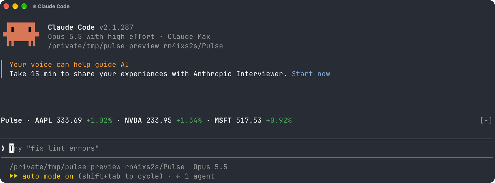
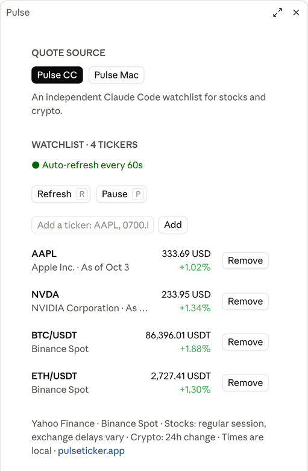
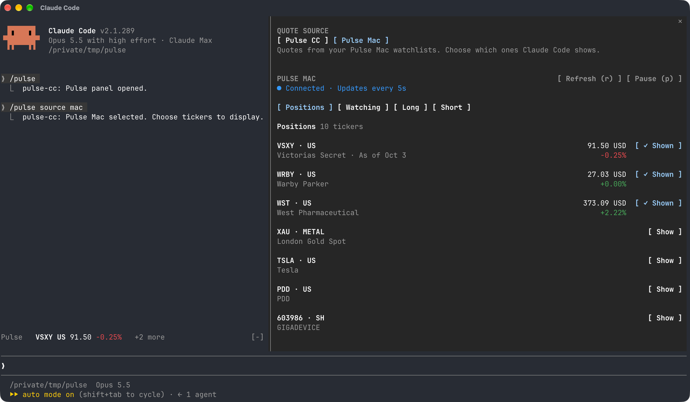
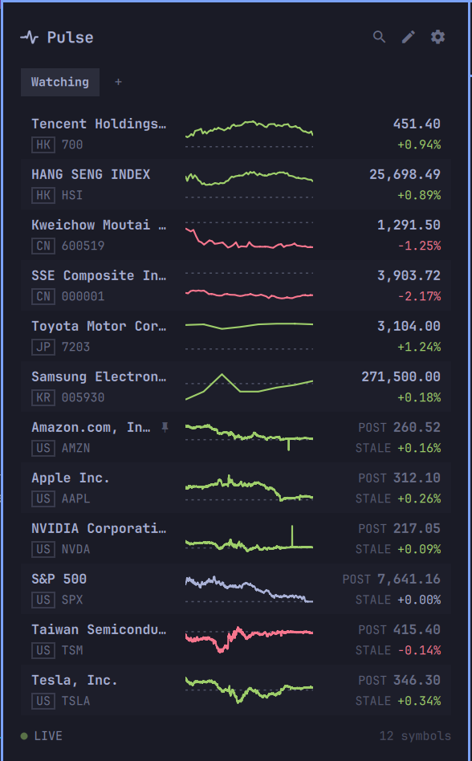

# Pulse

**Glanceable market data, wherever you work.**

[Website](https://www.pulseticker.app/) · [Mac App Store](https://apps.apple.com/app/id6812160110) · [Feedback](https://github.com/fatwang2/Pulse/issues)

Pulse is available for Mac, Claude Code, and Omarchy. The Mac app is closed source;
this repository maintains the MIT-licensed Claude Code plugin and Omarchy edition.

| Edition | Source | Get started |
| --- | --- | --- |
| **Pulse for Mac** | Closed source | [Website and downloads](https://www.pulseticker.app/) · [Mac App Store](https://apps.apple.com/app/id6812160110) |
| **Pulse for Claude Code** | Open-source plugin, MIT | [Installation and commands](plugins/claude-code/README.md) |
| **Pulse for Omarchy** | Open source, MIT | [Installation and features](omarchy/README.md) |

## Pulse for Mac

Market data in your macOS menu bar, with named watchlists, charts, and position
tracking. Visit [pulseticker.app](https://www.pulseticker.app/) for features,
downloads, and current purchase terms, or get Pulse from the
[Mac App Store](https://apps.apple.com/app/id6812160110).

Pulse for Mac is a paid app with a **30-day full-feature trial**, followed by
a **one-time purchase**. See [pricing and downloads](https://www.pulseticker.app/buy).


The current Mac application and website are developed in a private repository.
Their current source is not included here. The historical Mac edition through
**0.15.8** retains its original MIT license in Git history and version tags;
free installers remain available. See [historical Mac source and downloads](docs/history/README.md).

## Pulse for Claude Code

A Claude Code plugin that shows stock and crypto quotes with signed percentage
changes above the prompt, with a `/pulse` panel for adding and removing tickers,
refreshing prices, and pausing updates. The local MCP connection is included: download Pulse Mac,
paste its token, and choose which tickers from its groups appear in Claude Code.
Mac watchlists remain read-only
from the plugin. Requires Claude Code **2.1.287 or later**, with Mods enabled.



The `/pulse` panel works in the terminal and in Claude Desktop's **Code** tab:



Connect Pulse Mac to browse its watchlist groups and choose which tickers to display:



Install from GitHub:

```sh
claude plugin marketplace add fatwang2/Pulse
claude plugin install pulse-cc@pulse
```

Restart Claude Code or run `/reload-plugins`, then add a stock with
`/pulse add AAPL` or a crypto pair with `/pulse add BTC/USDT`, and open `/pulse`
to manage your watchlist.
To connect the Mac app, select **Pulse Mac** in `/pulse`, enable MCP in the app's
**Settings → Agent access**, then use **Paste token** to open the configuration
dialog. **Pulse Mac token** is the only setting.
See the [Claude Code guide](plugins/claude-code/README.md) for commands,
provider limits, privacy, Mac connection setup, and local development.

## Pulse for Omarchy

An independent Pulse edition for Omarchy, with market data in the bar, named
watchlists, symbol search, quote details, charts, and theme-aware presentation.
Requires Omarchy 4 and its Quickshell shell.



The existing managed installation continues to use the standalone repository
while its installation and update path is migrated:

```sh
omarchy plugin add https://github.com/fatwang2/omarchy-pulse.git --enable
```

The implementation is maintained in [`omarchy/`](omarchy/README.md).
See the [Omarchy guide](omarchy/README.md) for features and local development,
and [repository transition notes](docs/repository-transition.md) for migration details.

## Contributing and feedback

Start with [CONTRIBUTING.md](CONTRIBUTING.md). Each open-source edition has its
own implementation and tests; development does not require building the Mac app.
Use [GitHub Issues](https://github.com/fatwang2/Pulse/issues) and identify the edition.
Mac support is also available at [hello@pulseticker.app](mailto:hello@pulseticker.app).
Report security issues privately to [sys@pulseticker.app](mailto:sys@pulseticker.app).

## License

The Omarchy edition and Claude Code plugin retain their [MIT license](LICENSE)
and any component notices. That license does not apply to the current commercial
Mac binaries or provide rights to third-party market data. Historical Mac source
retains its original license.
